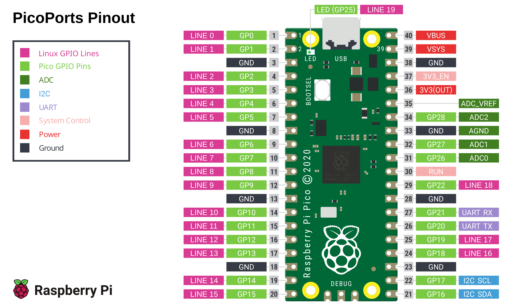

# PicoPorts

A USB-to-GPIO/ADC/I2C/UART interface based on the Raspberry Pi Pico 1.

The goal of this project is to be as easy as possible to setup and use. This is achieved by

- drag and drop firmware [installation](#installation)
- no driver installation on the host
- works with standard Linux tooling

## Usage

### Pinout

Pinout for the PicoPorts firmware variant with all interfaces:



Original image from [official Raspberry Pi documents](https://datasheets.raspberrypi.com/pico/Pico-R3-A4-Pinout.pdf).
Includes data from <https://pico.pinout.xyz>. Modified to include the Linux GPIO line numbers.

### GPIO

For GPIO access from the command line you can use the tools provided by the package `gpiod`

```bash
sudo apt install gpiod
```

Example: Read GP0

```bash
gpioget gpiochip0 0
```

Example: Set GP8 high for 1 second (gpio states persist after gpioset command exits)

```bash
gpioset gpiochip0 8=1
sleep 1
gpioset gpiochip0 8=0
```

Special case: Switch on Pico LED (connected to GP25)

```bash
gpioset gpiochip0 19=1
```

There are two firmware variants. On with GPIOs and interfaces and one with GPIOs only. The gpiochip
line numbers depend on the firmware variant:

| Pico pin GP_              | GP0 | GP1 | GP2 | GP3 | GP4 | GP5 | GP6 | GP7 | GP8 | GP9 | GP10 | GP11 | GP12 | GP13 | GP14 | GP15 | GP16 | GP17 | GP18 | GP19 | GP20 | GP21 | GP22 | GP26 | GP27 | GP28 | GP25* |
|---------------------------|-----|-----|-----|-----|-----|-----|-----|-----|-----|-----|------|------|------|------|------|------|------|------|------|------|------|------|------|------|------|------|-------|
| gpiochip line             |   0 |   1 |   2 |   3 |   4 |   5 |   6 |   7 |   8 |   9 |   10 |   11 |   12 |   13 |   14 |   15 |    - |    - |   16 |   17 |    - |    - |   18 |    - |    - |    - |    19 |
| gpiochip line (GPIO-only) |   0 |   1 |   2 |   3 |   4 |   5 |   6 |   7 |   8 |   9 |   10 |   11 |   12 |   13 |   14 |   15 |   16 |   17 |   18 |   19 |   20 |   21 |   22 |   23 |   24 |   25 |    26 |

*GP25 is connected to the LED

### ADC

Example: Analog read of GP26/ADC0 (in volt)

```bash
echo "$(cat /sys/bus/iio/devices/iio:device0/in_voltage0_raw) * $(cat /sys/bus/iio/devices/iio:device0/scale)" | bc
```

Special case: Analog read of Pico VSYS (in volt)

```bash
echo "$(cat /sys/bus/iio/devices/iio:device0/in_voltage3_raw) * $(cat /sys/bus/iio/devices/iio:device0/scale) * 3" | bc
```

Special case: Analog read of Pico onboard temperature sensor (in degree Celsius)

```bash
echo "27.0 - ($(cat /sys/bus/iio/devices/iio:device0/in_voltage4_raw) * $(cat /sys/bus/iio/devices/iio:device0/scale) - 0.706) / 0.001721" | bc
```

The voltage index (`X` in `in_voltageX_raw`) depends on the firmware variant:

| Pico Pin                  | GP26/ADC0 | GP27/ADC1 | GP28/ADC2 | VSYS/3 | int. temp. |
|---------------------------|-----------|-----------|-----------|--------|------------|
| voltage index             |         0 |         1 |         2 |      3 |          4 |
| voltage index (GPIO-only) |         - |         - |         - |      0 |          1 |

### I2C

For I2C access from the command line you can use the tools provided by the package `i2c-tools`

```bash
sudo apt install i2c-tools
```

Example: Find your I2C device number (look for "dln2-i2c" in the third column)

```bash
i2cdetect -l
# Example output:
# i2c-0   smbus   SMBus I801 adapter at efa0   SMBus adapter
# i2c-1   i2c     dln2-i2c-3-1.1:1.0-0         I2C adapter
```

Example: Scan for device on I2C bus using read operation* (using I2C device `i2c-1`)

```bash
i2cdetect -r 1
```

*I2C quick write is not supported, so detection has to use the read command (`-r` option).

Example: Write `0x40 0xff` to the device at I2C address `0x48` (using I2C device `i2c-1`)

```bash
i2cset 1 0x48 0x40 0xff
```

Example: Read data from the device at I2C address `0x48` (using I2C device `i2c-1`)

```bash
i2cget 1 0x48
```

Example: Attach kernel driver `pcf8591` for a Philips PCF8591 ADC/DAC at I2C address `0x48` (using
I2C device `i2c-1`)

```bash
echo pcf8591 0x48 | sudo tee /sys/class/i2c-adapter/i2c-1/new_device
# Example: Read value from first ADC channel
cat /sys/class/i2c-adapter/i2c-1/1-0048/in0_input
```

I2C is only available in the full firmware variant (not in the `GPIO-only` variant).

| Pico Pin | GP16 | GP17 |
|----------|------|------|
| I2C line |  SDA |  SCL |

### UART

Example: Open a serial terminal to interact with the UART (using tty device `/dev/ttyACM0` and `tio`
tool)

```bash
tio /dev/ttyACM0
```

Note: Currently UART uses 115200 baud (8n1) only (TODO).

UART is only available in the full firmware variant (not in the `GPIO-only` variant).

| Pico Pin  | GP20 | GP21 |
|-----------|------|------|
| UART line |   TX |   RX |

## Installation

1. [Download the firmware](https://github.com/gschwaer/picoports/releases/latest).
2. Use [Drag-and-drop installation](https://www.raspberrypi.com/documentation/microcontrollers/micropython.html#drag-and-drop-micropython).
   1. Press and hold the `BOOTSEL` button on your Pico.
   2. Plug the Pico into your PC, the Pico will open as thumb drive.
   3. Copy the firmware onto the Pico thumb drive.

## Development

### Setup

```shell
git clone --no-recurse-submodules https://github.com/gschwaer/picoports.git
cd picoports
git submodule update --init -- pico-sdk
git -C pico-sdk submodule update --init -- lib/tinyusb
```

### Build

```shell
cmake -B build
make -C build
```

### Further resources

- All one needs to know about USB: <https://www.beyondlogic.org/usbnutshell/usb1.shtml>
